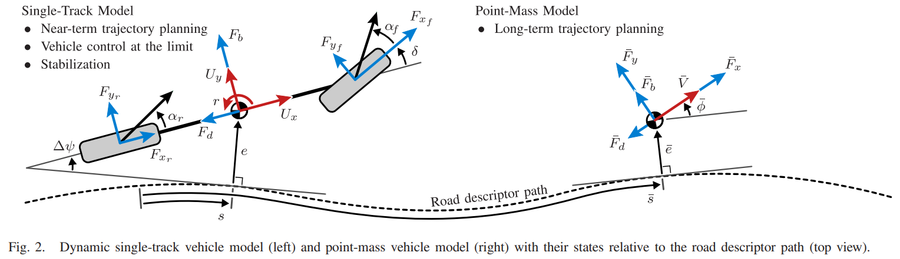
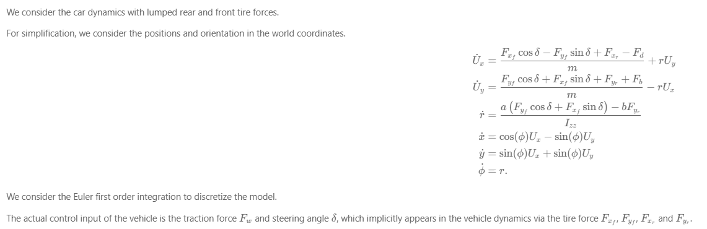
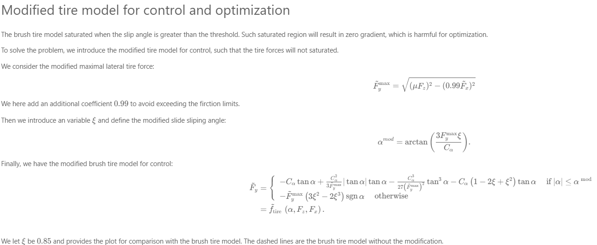
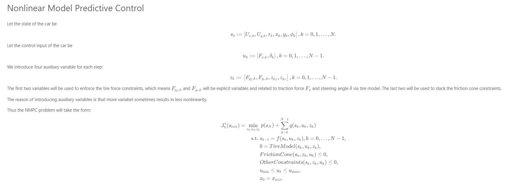
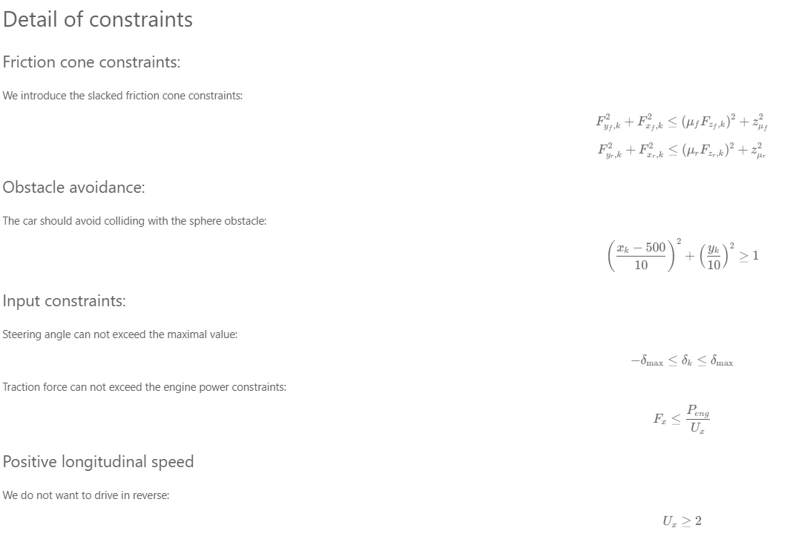
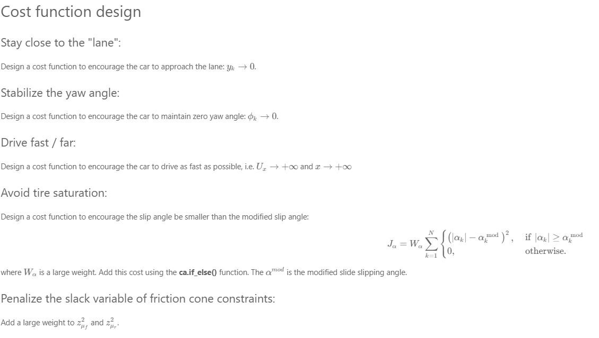
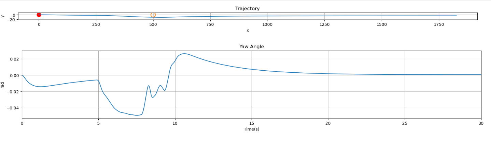

# Non-Linear-MPC Drag Racing

In this, we will design a nonlinear MPC controller to let the car to travel as far as possible in positive $x$ direction in a fixed time interval. 
We are supposed to keep close to $y = 0$, while avoiding the obstacle located at $x = 500, y = 0$. 
The key to this problem is to use as much tire forces as possible, while ensuring that the car does not lose control. 
This repository contains an implementation of Nonlinear Model Predictive Control (NMPC) for controlling the dynamics of a car. NMPC is a powerful technique for controlling systems with nonlinear dynamics and constraints. In this case, we are using NMPC to control the motion of a car, taking into account various constraints such as tire forces and friction cone constraints.

# Car Dynamics

1. 
2. 
3. 
4. 
5. 
6. 
 

